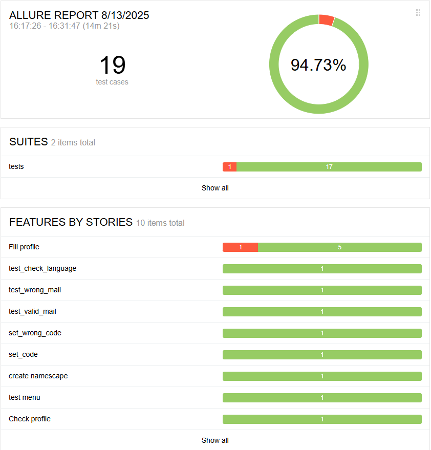
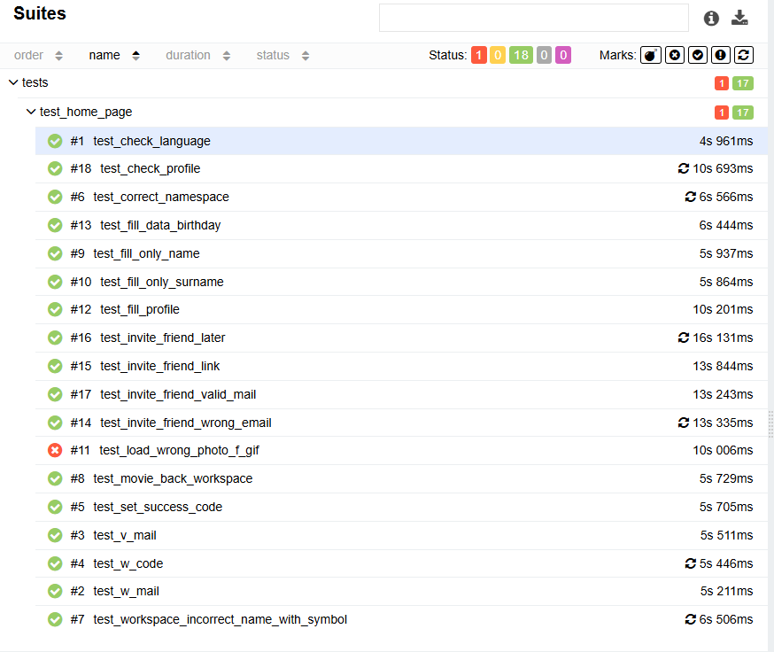

<h1> Проект по тестированию сервиса lenzaos</h1>

> <a target="_blank" href="https://auth.lenzaos.com/">Ссылка на сайт</a>

<h3> Список проверок, реализованных в автотестах:</h3>

### UI-тесты
- [x] Смена языков на первой странице авторизации 
- [x] Страница ввода почты
- [x] Страница ввода кода с почты
- [x] Проверка перехода на этап создания нового пространства
- [x] Назначения имени воркспейса
- [x] Этапы заполнения личных данных профиля
- [x] Этап установки даты рождения пользователя
- [x] Этап приглашения участников в воркспейс
- [x] Проверка валидности введенных данных в профиле пользователя

----
### Проект реализован с использованием:
      

----
### Allure отчет

#### Общие результаты

#### Список тест кейсов

## [Видео прохождения автотестов](pages/allure3.gif)
